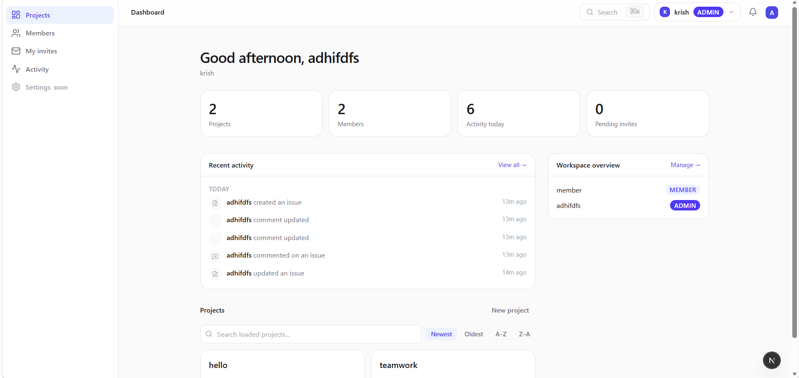
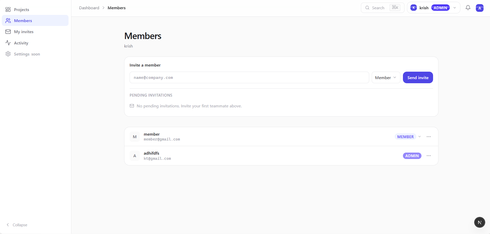
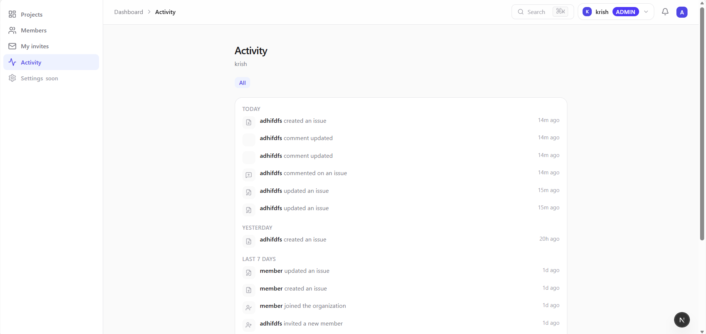
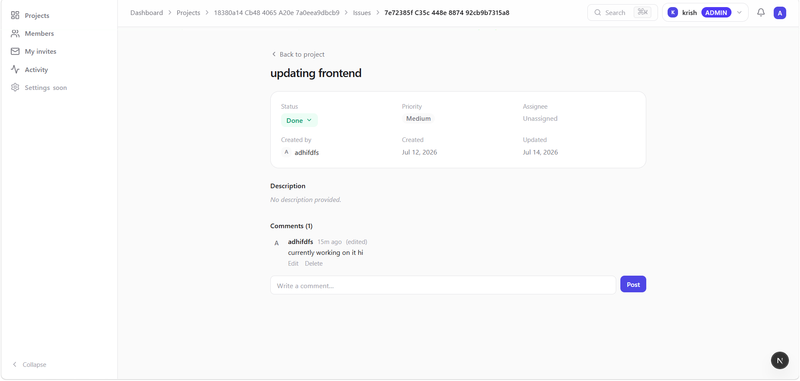

# TeamDesk

A secure, multi-tenant issue-tracking platform built to demonstrate depth on one hard engineering problem — **authorization in a multi-tenant system** — rather than breadth of features.

TeamDesk is not trying to be a Jira or Linear clone. It deliberately ships a narrow feature set (organizations, projects, issues, comments, invitations, role management, activity logging) so that the authorization and multi-tenancy model underneath it can be built correctly, tested against real attack patterns, and explained clearly.

> **The architecture is the product.** Users see issues. Engineers reviewing this repo see the invariant every design decision serves: no organization can ever access another organization's data.

---

## Live demo

[https://teamdesk-frontend.vercel.app/]

## Screenshots






---

## Why this project exists

Most portfolio CRUD apps demonstrate that you can wire a frontend to a backend. This one demonstrates something narrower and harder: that you can reason correctly about **who is allowed to see and change what**, in a system where that boundary (organization membership) is the entire security model — not an afterthought bolted on top of a working app.

Every major decision in this codebase — denormalized `organizationId` on every resource, JWTs that carry only identity (roles are loaded fresh per request, never cached in the token), server-side-only org-context derivation — exists to make that one invariant airtight and testable.

## Tech stack

**Backend**: Express + TypeScript + Prisma + PostgreSQL (Neon), Redis (Upstash) for membership-role caching
**Frontend**: Next.js (App Router) + TypeScript + Tailwind v4, a small custom design system on shadcn/ui + Radix primitives
**Deployment**: Render (backend), Vercel (frontend)

## Core features

- **Multi-tenant organizations** with role-based membership (`VIEWER` < `MEMBER` < `MANAGER` < `ADMIN`)
- **Projects and issues** with status, priority, and threaded comments
- **Invitation workflow** — invite by email, accept/reject, with a last-remaining-admin lockout that blocks both demoting and removing an organization's sole admin
- **Activity feed** — an audit trail of every meaningful mutation, grouped into a readable timeline
- **Cursor-based pagination** throughout, chosen deliberately over offset pagination (see [`ARCHITECTURE.md`](./ARCHITECTURE.md#pagination))
- **Redis-cached membership roles** with targeted invalidation on the three mutations that actually cause staleness

## What this project is _not_ trying to be

Labels, saved filters, notifications, Kanban drag-and-drop, a command palette, dark mode, analytics dashboards — all deliberately out of scope. Every one of these was considered and rejected as breadth-without-depth; see [`ROADMAP.md`](./ROADMAP.md) for the reasoning on each.

---

## Documentation

- [`ARCHITECTURE.md`](./ARCHITECTURE.md) — system design, folder structure, the authorization model, design decisions and trade-offs
- [`API.md`](./API.md) — backend endpoint reference
- [`DEPLOYMENT.md`](./DEPLOYMENT.md) — local setup, environment variables, production deployment
- [`ROADMAP.md`](./ROADMAP.md) — what's deliberately deferred and why

## Quick start

```bash
# backend
cd teamdesk-backend
npm install
cp .env.example .env      # fill in DATABASE_URL, TEST_DATABASE_URL, REDIS_URL, JWT secrets
npx prisma migrate deploy
npm run dev

# frontend
cd teamdesk-frontend
npm install
cp .env.example .env.local   # NEXT_PUBLIC_API_URL
npm run dev
```

Full environment variable reference in [`DEPLOYMENT.md`](./DEPLOYMENT.md).

## Testing

```bash
# backend
npm test

# frontend
npx tsc --noEmit && npm run lint && npm run build
```

## Known trade-offs

Documented in full in [`ARCHITECTURE.md`](./ARCHITECTURE.md#known-trade-offs) and [`ROADMAP.md`](./ROADMAP.md) — including the deliberate choice not to add CSRF double-submit tokens yet (cookie-based auth + cross-domain `sameSite: "none"` is a named, understood next step for production, not an unaddressed gap), the shared rate-limiter bucket across `/login`/`/signup`/`/refresh`, and the missing `(organizationId, createdAt)` composite index.

## License

MIT — see [LICENSE](./LICENSE).
